# System Flow Diagrams - Agentic Data Product Builder

## 1. Data Ingestion & Processing Flow (Offline/Backend Flow)

This diagram shows the **backend data pipeline** from raw data generation to storage and metadata management.


---

## 2. User Flow Diagram (Application Usage)

This diagram shows the **user interaction flow** when requesting a Data Product through the application.

```mermaid
graph TB
    subgraph "USER INTERFACE (Presentation Layer)"
        A1[User] --> B{Entry Point}
        B -->|Option 1| C1[Streamlit Web UI<br/>Port 8501]
        B -->|Option 2| C2[REST API<br/>FastAPI - Port 8000]
        B -->|Option 3| C3[CLI Tool<br/>Batch Mode]
        
        C1 & C2 & C3 --> D[Natural Language Request<br/>Example: 'I need daily sales<br/>analytics by region and category']
    end
    
    subgraph "ORCHESTRATION LAYER"
        D --> E[Orchestrator Agent<br/>LangGraph StateGraph]
        E --> F[Initialize Workflow State]
        F --> G[Request Validation]
        G --> H[Create Session ID<br/>& Execution Log]
    end
    
    subgraph "AGENT PIPELINE (Sequential Execution)"
        H --> I1[1️⃣ INTENT AGENT]
        I1 --> I2[📝 LLM Call: Extract<br/>Business Requirements]
        I2 --> I3[🔍 KG Query: Map<br/>Business Terms]
        I3 --> I4[Output: Metrics, Dimensions,<br/>Granularity, Filters]
        I4 --> I5[⏱️ Execution Time: ~2s]
        
        I5 --> J1[2️⃣ DISCOVERY AGENT]
        J1 --> J2[🔍 KG Query: Find<br/>Relevant Datasets]
        J2 --> J3[🧮 Semantic Search:<br/>Column Embeddings]
        J3 --> J4[📊 Ranking: Relevance,<br/>Quality, Freshness]
        J4 --> J5[Output: Selected Datasets<br/>with Metadata]
        J5 --> J6[⏱️ Execution Time: ~3s]
        
        J6 --> K1[3️⃣ MODELING AGENT]
        K1 --> K2[📝 LLM Call: Design<br/>Target Schema]
        K2 --> K3[🔧 Infer Primary Keys<br/>& Constraints]
        K3 --> K4[Output: Target Schema,<br/>Grain, Partitioning]
        K4 --> K5[⏱️ Execution Time: ~2s]
        
        K5 --> L1[4️⃣ TRANSFORMATION AGENT]
        L1 --> L2[📝 LLM Call: Generate<br/>SQL/PySpark Code]
        L2 --> L3[✅ Syntax Validation<br/>sqlparse]
        L3 --> L4[🧪 Test Execution<br/>on DuckDB]
        L4 --> L5{Valid?}
        L5 -->|No| L2
        L5 -->|Yes| L6[Output: Transformation<br/>Code & Dependencies]
        L6 --> L7[⏱️ Execution Time: ~4s]
        
        L7 --> M1[5️⃣ QUALITY AGENT]
        M1 --> M2[🔍 Schema-Based Rules:<br/>NOT NULL, PKs]
        M2 --> M3[🔍 KG Query: Historical<br/>Quality Rules]
        M3 --> M4[📝 LLM Call: Business<br/>Logic Rules]
        M4 --> M5[Output: Quality Rules,<br/>SLA Requirements, Tests]
        M5 --> M6[⏱️ Execution Time: ~2s]
        
        M6 --> N1[6️⃣ PACKAGING AGENT]
        N1 --> N2[📦 Compile All Outputs<br/>into Specification]
        N2 --> N3[✅ Validate Against<br/>JSON Schema]
        N3 --> N4[📄 Generate YAML/JSON<br/>& Documentation]
        N4 --> N5[🔗 Create Lineage Graph]
        N5 --> N6[Output: Complete Data<br/>Product Specification]
        N6 --> N7[⏱️ Execution Time: ~1s]
    end
    
    subgraph "RESPONSE PREPARATION"
        N7 --> O[Orchestrator Collects<br/>Final State]
        O --> P[Compile Execution Log]
        P --> P1[Agent Execution Times]
        P --> P2[LLM Token Usage]
        P --> P3[KG Query Counts]
        P --> P4[Warnings & Errors]
        
        P1 & P2 & P3 & P4 --> Q[Response Payload<br/>Total Time: 12-18s]
    end
    
    subgraph "RESPONSE DELIVERY"
        Q --> R{Return to User}
        
        R -->|Streamlit| S1[Display Success Message]
        S1 --> S2[Render YAML Specification<br/>with Syntax Highlighting]
        S2 --> S3[Visualize Lineage Graph]
        S3 --> S4[Show SQL Code Preview]
        S4 --> S5[Download Button<br/>for YAML File]
        S5 --> S6[Execution Metrics<br/>& Agent Logs]
        
        R -->|REST API| T1[HTTP 200 Response]
        T1 --> T2[JSON Payload:<br/>data_product_spec]
        T2 --> T3[execution_time_ms]
        T3 --> T4[agent_logs array]
        T4 --> T5[yaml_output string]
        
        R -->|CLI| U1[Print Specification<br/>to stdout]
        U1 --> U2[Save to File<br/>data_product.yaml]
    end
    
    subgraph "USER REVIEW & DEPLOYMENT"
        S6 & T5 & U2 --> V[User Reviews<br/>Generated Specification]
        V --> W{Satisfied?}
        W -->|No| X[Refine Request<br/>& Retry]
        X --> D
        W -->|Yes| Y[Deploy Data Product]
        Y --> Z1[dbt Integration]
        Y --> Z2[Airflow Orchestration]
        Y --> Z3[Data Catalog Registration]
        Y --> Z4[CI/CD Pipeline]
    end
    
    style D fill:#e1f5ff
    style E fill:#fff3cd
    style I1 fill:#d4edda
    style J1 fill:#d4edda
    style K1 fill:#d4edda
    style L1 fill:#d4edda
    style M1 fill:#d4edda
    style N1 fill:#d4edda
    style Q fill:#f8d7da
    style V fill:#ffeaa7
```



---

## 3. Detailed State Flow (Agent State Transitions)

This diagram shows how **state is updated** as it passes through each agent.


---

## 4. Knowledge Graph Query Flow (Discovery Agent Deep Dive)

This diagram shows how the **Discovery Agent** queries the Knowledge Graph.

```mermaid
graph TB
    subgraph "INPUT FROM INTENT AGENT"
        A[Business Metrics:<br/>revenue, order_count, units_sold]
        B[Dimensions:<br/>region, category]
        C[Temporal Granularity:<br/>daily]
    end
    
    A & B & C --> D[Discovery Agent Starts]
    
    subgraph "PARALLEL SEARCH STRATEGIES"
        D --> E1[Strategy 1:<br/>Term-Based Lookup]
        D --> E2[Strategy 2:<br/>Semantic Search]
        
        E1 --> F1[Cypher Query:<br/>MATCH Column -MAPS_TO-> BusinessTerm<br/>WHERE term IN ['revenue', 'sales']]
        F1 --> G1[Results:<br/>bronze.orders.total_amount<br/>bronze.orders.order_id]
        
        E2 --> F2[Generate Query Embedding<br/>OpenAI API]
        F2 --> G2[Vector Similarity Search<br/>Cosine Distance > 0.7]
        G2 --> H2[Results:<br/>Semantically Similar Columns]
    end
    
    subgraph "RESULT MERGING & RANKING"
        G1 & H2 --> I[Merge Results]
        I --> J[Score Each Dataset]
        
        J --> K1[Column Coverage<br/>40% weight]
        J --> K2[Quality Score<br/>30% weight]
        J --> K3[Freshness Match<br/>20% weight]
        J --> K4[Popularity<br/>10% weight]
        
        K1 & K2 & K3 & K4 --> L[Rank Datasets]
    end
    
    subgraph "METADATA RETRIEVAL"
        L --> M[Top 5 Datasets]
        M --> N[For Each Dataset:<br/>Retrieve Full Metadata]
        
        N --> O1[Schema Information<br/>All Columns & Types]
        N --> O2[Row Count & Size]
        N --> O3[Quality Metrics<br/>Null %, Duplicates]
        N --> O4[Access Permissions<br/>Owner, Roles]
        N --> O5[Sample Values<br/>Data Preview]
    end
    
    subgraph "FINAL SELECTION"
        O1 & O2 & O3 & O4 & O5 --> P[Complete Candidate List]
        P --> Q[Filter by Access]
        Q --> R[Select Top 2-3 Datasets]
        R --> S[OUTPUT:<br/>Selected Datasets with<br/>Full Metadata]
    end
    
    S --> T[Pass to Modeling Agent]
    
    style D fill:#e1f5ff
    style I fill:#fff3cd
    style L fill:#d4edda
    style S fill:#f8d7da
```

---

## 5. Error Handling Flow

This diagram shows how **errors are handled and retries** are managed.


---

## Summary

### Flow 1: Data Ingestion & Processing (Offline/Backend)
- **Data Generation** → **Bronze Storage** → **Metadata Extraction** → **Knowledge Graph** → **Query Layer** → **On-Demand Transformation** → **Gold Data Products**

### Flow 2: User Application Flow (Real-Time)
- **User Request** → **Orchestrator** → **6 Agent Pipeline** → **Validation & Packaging** → **Response Delivery** → **User Review & Deployment**

### Key Characteristics:
1. **Offline Setup**: Bronze layer is pre-generated with synthetic data
2. **Real-Time Processing**: Agent pipeline executes on-demand (12-18 seconds)
3. **Knowledge Graph**: Acts as central metadata repository for discovery
4. **State Management**: LangGraph maintains state across agent transitions
5. **Error Resilience**: Retry logic, fallbacks, and partial results handling
6. **Multi-Interface**: Supports UI, API, and CLI for flexibility

---

**Document Created**: November 26, 2025  
**Author**: AI Assistant  
**Purpose**: Visual documentation of system flows

