# Simplified Data Ingestion & Processing Flow

## Visual Flow Diagram

```mermaid
flowchart LR
    A["📊 Data Generation<br/>Faker, NumPy, Pandas"] --> B["💾 Bronze Storage<br/>Parquet Files"]
    B --> C["🔍 Metadata Extraction<br/>Schema + Embeddings"]
    C --> D["🕸️ Knowledge Graph<br/>Neo4j"]
    D --> E["🔎 Query Layer<br/>DuckDB"]
    E --> F["⚙️ Transformation<br/>LLM + SQL"]
    F --> G["🎁 Gold Products<br/>YAML Specs"]
    
    style A fill:#e3f2fd,stroke:#1976d2,stroke-width:2px
    style B fill:#fff3e0,stroke:#f57c00,stroke-width:2px
    style C fill:#f3e5f5,stroke:#7b1fa2,stroke-width:2px
    style D fill:#e8f5e9,stroke:#388e3c,stroke-width:2px
    style E fill:#e1f5fe,stroke:#0288d1,stroke-width:2px
    style F fill:#fff9c4,stroke:#f9a825,stroke-width:2px
    style G fill:#ffebee,stroke:#c62828,stroke-width:2px
```



---

## Component Descriptions

### 1️⃣ Data Generation
**What it does:**  
Creates synthetic realistic datasets (customers, orders, products, campaigns, events) with intentional quality issues for testing.

**Technology:**  
`Python` • `Faker` • `NumPy` • `Pandas`

**Output:** 7 datasets, 816K total rows, ~93 MB

---

### 2️⃣ Bronze Storage
**What it does:**  
Stores raw data files in columnar format with metadata, maintaining referential integrity across tables.

**Technology:**  
`Parquet` • `PyArrow` • File System

**Output:** `/data/bronze/*.parquet` + `_metadata.json`

---

### 3️⃣ Metadata Extraction
**What it does:**  
Analyzes data to extract schema, statistics (min/max/null%), sample values, and generates embeddings for semantic search.

**Technology:**  
`Pandas` • `OpenAI Embeddings API` • JSON

**Output:** Schema definitions, column embeddings (768-dim vectors)

---

### 4️⃣ Knowledge Graph
**What it does:**  
Stores metadata as interconnected graph nodes (datasets, columns, business terms) enabling semantic discovery and lineage tracking.

**Technology:**  
`Neo4j` • `Cypher Query Language` • Graph Algorithms

**Output:** Graph DB with ~8K nodes, ~15K relationships

---

### 5️⃣ Query Layer
**What it does:**  
Provides in-memory SQL interface to query Bronze data for validation, testing, and preview during transformation generation.

**Technology:**  
`DuckDB` • SQL Interface • Parquet Reader

**Output:** Query results, validation checks

---

### 6️⃣ On-Demand Transformation
**What it does:**  
Agents generate SQL/PySpark code dynamically based on user requests, validated against actual data before delivery.

**Technology:**  
`LLM (GPT-4)` • `sqlparse` • `DuckDB` • PySpark

**Output:** Validated transformation code (SQL or PySpark)

---

### 7️⃣ Gold Data Products
**What it does:**  
Complete packaged specification with schema, transformation code, quality rules, SLA, and lineage ready for production deployment.

**Technology:**  
`YAML/JSON` • Jinja2 Templates • JSON Schema Validation

**Output:** `data_product_spec.yaml` (deployable artifact)

---

## End-to-End Example

```
📊 INPUT (Offline Setup)
   └─ Run: python generate_bronze.py
   └─ Creates: 816K rows across 7 tables
   └─ Time: ~5 minutes

💾 STORAGE
   └─ Files: data/bronze/orders.parquet (100K rows, 15 MB)
   └─ Format: Snappy-compressed Parquet
   └─ Metadata: _metadata.json with statistics

🔍 INDEXING
   └─ Extract: 87 columns across 7 datasets
   └─ Generate: 87 embeddings via OpenAI API
   └─ Cost: ~$0.01 per run

🕸️ GRAPH POPULATION
   └─ Nodes: 7 Datasets + 87 Columns + 50 BusinessTerms
   └─ Edges: HAS_COLUMN, MAPS_TO, HAS_QUALITY_RULE
   └─ Query Time: <100ms (indexed)

🔎 QUERY INTERFACE
   └─ Register: 7 Parquet files as SQL views
   └─ Query: SELECT * FROM bronze_orders LIMIT 10
   └─ Speed: 10-50ms per query

⚙️ TRANSFORMATION (On-Demand)
   └─ User Request: "Daily sales by region"
   └─ Agent Generates: SQL with JOIN + GROUP BY
   └─ Validated: Executes on DuckDB, checks schema
   └─ Time: ~4 seconds

🎁 FINAL OUTPUT
   └─ Specification: 300-line YAML file
   └─ Includes: Schema, SQL, Quality Rules, Lineage
   └─ Ready For: dbt, Airflow, Dagster deployment
```

---

## Technology Stack Summary

| Layer | Primary Technology | Purpose |
|-------|-------------------|---------|
| **Generation** | Faker, NumPy | Synthetic data creation |
| **Storage** | Parquet, PyArrow | Efficient columnar storage |
| **Extraction** | Pandas, OpenAI | Schema & embedding extraction |
| **Graph** | Neo4j, Cypher | Metadata relationships |
| **Query** | DuckDB | In-memory SQL analytics |
| **Transform** | GPT-4, sqlparse | Code generation & validation |
| **Product** | YAML, JSON Schema | Specification packaging |

---

## Key Design Decisions

### Why Parquet?
Columnar format is 60-80% smaller than CSV and 10x faster to query for analytics workloads.

### Why Neo4j?
Graph structure naturally represents metadata relationships (dataset→column→business term) better than relational tables.

### Why DuckDB?
Zero-config embedded database with native Parquet support, perfect for validation without spinning up infrastructure.

### Why Embeddings?
Enables semantic search: user asks for "revenue" → finds columns like "total_amount", "sales", "income" automatically.

---

**Created:** November 26, 2025  
**Format:** Simplified for presentation & documentation

