# Simplified User Flow Diagram

## Visual Flow Diagram

```mermaid
flowchart LR
    A["👤 User Request<br/>Natural Language"] --> B["🎯 Orchestrator<br/>LangGraph"]
    
    B --> C1["1️⃣ Intent<br/>~2s"]
    C1 --> C2["2️⃣ Discovery<br/>~3s"]
    C2 --> C3["3️⃣ Modeling<br/>~2s"]
    C3 --> C4["4️⃣ Transform<br/>~4s"]
    C4 --> C5["5️⃣ Quality<br/>~2s"]
    C5 --> C6["6️⃣ Packaging<br/>~1s"]
    
    C6 --> D["📦 Data Product<br/>YAML Spec"]
    D --> E["✅ Review<br/>Deploy"]
    
    style A fill:#e3f2fd,stroke:#1976d2,stroke-width:2px
    style B fill:#fff3e0,stroke:#f57c00,stroke-width:2px
    style C1 fill:#e8f5e9,stroke:#388e3c,stroke-width:2px
    style C2 fill:#e8f5e9,stroke:#388e3c,stroke-width:2px
    style C3 fill:#e8f5e9,stroke:#388e3c,stroke-width:2px
    style C4 fill:#e8f5e9,stroke:#388e3c,stroke-width:2px
    style C5 fill:#e8f5e9,stroke:#388e3c,stroke-width:2px
    style C6 fill:#e8f5e9,stroke:#388e3c,stroke-width:2px
    style D fill:#ffebee,stroke:#c62828,stroke-width:2px
    style E fill:#f3e5f5,stroke:#7b1fa2,stroke-width:2px
```



---

## Component Descriptions

### 👤 User Request
Submits natural language request via Streamlit UI, REST API, or CLI.  
**Technology:** `Streamlit` • `FastAPI` • Python CLI

---

### 🎯 Orchestrator
Initializes workflow state and coordinates sequential agent execution.  
**Technology:** `LangGraph StateGraph` • Python  
**Time:** <1s

---

### 1️⃣ Intent Agent
Extracts business metrics, dimensions, and temporal granularity using LLM and Knowledge Graph.  
**Technology:** `GPT-4` • `Neo4j` • OpenAI API  
**Time:** ~2s

---

### 2️⃣ Discovery Agent
Searches Knowledge Graph using semantic embeddings and term matching to find relevant datasets.  
**Technology:** `Neo4j Cypher` • `Vector Search` • OpenAI Embeddings  
**Time:** ~3s

---

### 3️⃣ Modeling Agent
Designs target schema with columns, types, constraints, and partitioning strategy.  
**Technology:** `GPT-4` • JSON Schema Validation  
**Time:** ~2s

---

### 4️⃣ Transform Agent
Generates SQL/PySpark code, validates syntax, and tests execution on bronze data.  
**Technology:** `GPT-4` • `sqlparse` • `DuckDB`  
**Time:** ~4s

---

### 5️⃣ Quality Agent
Defines data quality rules, SLA requirements, and generates test code.  
**Technology:** `GPT-4` • `Great Expectations` • dbt  
**Time:** ~2s

---

### 6️⃣ Packaging Agent
Compiles all outputs into validated YAML specification with metadata and lineage.  
**Technology:** `YAML` • `JSON Schema` • Jinja2  
**Time:** ~1s

---

### 📦 Data Product Spec
Complete deployable specification with schema, SQL, quality rules, and documentation.  
**Format:** YAML/JSON (300-500 lines)

---

### ✅ User Review
User reviews specification and either deploys to production or refines the request.  
**Integration:** dbt, Airflow, Dagster, Data Catalog

---

## Execution Flow Summary

```
┌─────────────────────────────────────────────────────────────────┐
│  USER INPUT: "Daily sales analytics by region and category"     │
└────────────────────────────┬────────────────────────────────────┘
                             │
                             ▼
              ┌──────────────────────────┐
              │   ORCHESTRATOR STARTS    │
              │   Session ID: abc-123    │
              └────────────┬─────────────┘
                           │
        ┌──────────────────┼──────────────────┐
        │                  │                  │
        ▼                  ▼                  ▼
   Intent Agent      Discovery Agent    Modeling Agent
     ~2 sec              ~3 sec            ~2 sec
        │                  │                  │
        └──────────────────┼──────────────────┘
                           │
        ┌──────────────────┼──────────────────┐
        │                  │                  │
        ▼                  ▼                  ▼
  Transform Agent     Quality Agent     Packaging Agent
     ~4 sec              ~2 sec            ~1 sec
        │                  │                  │
        └──────────────────┼──────────────────┘
                           │
                           ▼
              ┌──────────────────────────┐
              │   YAML SPECIFICATION     │
              │   Total Time: 14 sec     │
              │   LLM Calls: 4           │
              │   KG Queries: 6          │
              └────────────┬─────────────┘
                           │
                           ▼
              ┌──────────────────────────┐
              │   USER RECEIVES OUTPUT   │
              │   - YAML file            │
              │   - SQL code             │
              │   - Quality rules        │
              │   - Lineage graph        │
              └──────────────────────────┘
```

---

## Entry Points

### Option 1: Streamlit UI
```bash
streamlit run ui/streamlit_app.py
```
- Interactive web interface at `localhost:8501`
- Visual feedback, syntax highlighting, download buttons

### Option 2: REST API
```bash
curl -X POST http://localhost:8000/api/v1/generate \
  -H "Content-Type: application/json" \
  -d '{"user_request": "Daily sales by region"}'
```
- Programmatic access, JSON response
- Integration with other services

### Option 3: CLI
```bash
python cli/generate.py --request "Daily sales by region" --output spec.yaml
```
- Batch processing, automation scripts
- CI/CD pipeline integration

---

## State Evolution

| Agent | State Before | State After |
|-------|-------------|-------------|
| **Intent** | `user_request: str` | `+ business_metrics, dimensions, granularity` |
| **Discovery** | `+ business_metrics` | `+ selected_datasets, metadata` |
| **Modeling** | `+ selected_datasets` | `+ target_schema, grain, primary_keys` |
| **Transform** | `+ target_schema` | `+ transformation_code, is_valid` |
| **Quality** | `+ transformation_code` | `+ quality_rules, sla_requirements` |
| **Packaging** | `+ all outputs` | `+ data_product_spec, yaml_output` |

---

## Example Output

### Input
```
"I need daily sales analytics by region and category"
```

### Output (YAML - Condensed)
```yaml
data_product:
  metadata:
    name: daily_sales_analytics
    version: 1.0.0
  
  data_model:
    target_table: gold.daily_sales_analytics
    grain: "Daily, by region and category"
    schema:
      - {name: date, type: DATE, primary_key: true}
      - {name: region, type: VARCHAR, primary_key: true}
      - {name: category, type: VARCHAR, primary_key: true}
      - {name: total_revenue, type: DECIMAL(18,2)}
      - {name: order_count, type: INTEGER}
  
  source_datasets:
    - bronze.orders
    - bronze.products
  
  transformations:
    language: SQL
    code: |
      SELECT DATE(o.order_date) AS date,
             o.region, p.category,
             SUM(o.total_amount) AS total_revenue,
             COUNT(DISTINCT o.order_id) AS order_count
      FROM bronze.orders o
      JOIN bronze.products p USING (product_id)
      WHERE o.status = 'completed'
      GROUP BY 1, 2, 3
  
  quality_rules:
    - {rule: "total_revenue > 0", severity: error}
    - {rule: "date IS NOT NULL", severity: error}
  
  sla:
    freshness: "Daily at 6:00 AM UTC"
    latency: "< 30 minutes"
```

---

## Performance Metrics

| Metric | Target | Typical |
|--------|--------|---------|
| **End-to-End Time** | < 20s | 12-18s |
| **LLM Calls** | 4-6 | 4 |
| **KG Queries** | 5-10 | 6-7 |
| **Token Usage** | < 10K | 6-8K |
| **Success Rate** | > 85% | ~90% |

---

## Error Handling

### If SQL Generation Fails
1. Validate syntax → Retry with error feedback (max 3x)
2. Still fails → Fallback to template-based generation
3. No template → Return partial spec with warning

### If Dataset Not Found
1. Discovery returns empty results
2. Orchestrator prompts user for clarification
3. User refines request or manually selects datasets

### If Validation Fails
1. Packaging detects schema errors
2. Attempts to infer missing fields from context
3. Returns spec with warnings if incomplete

---

**Created:** November 26, 2025  
**Format:** Simplified for quick understanding  
**Total Flow Time:** 12-18 seconds from request to response

