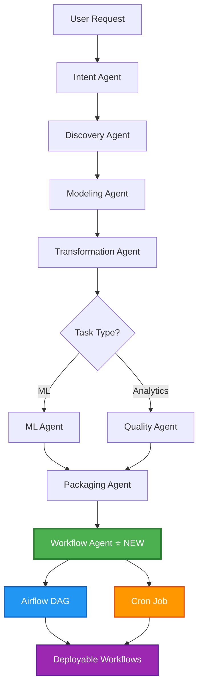
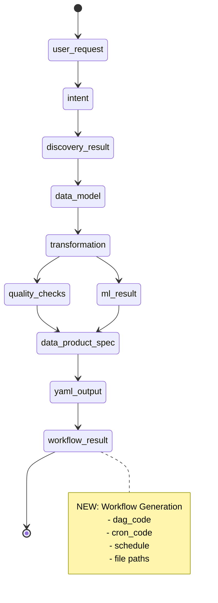
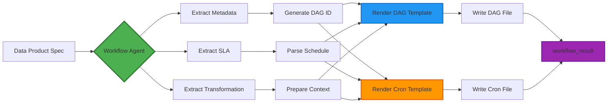
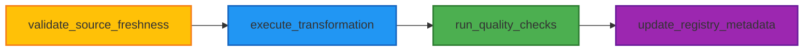
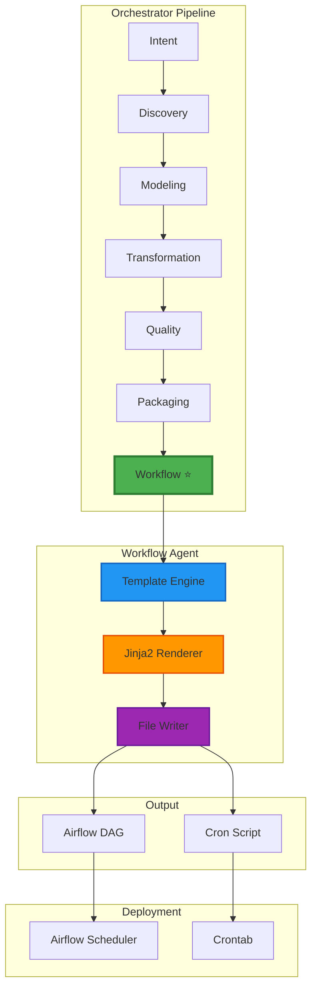
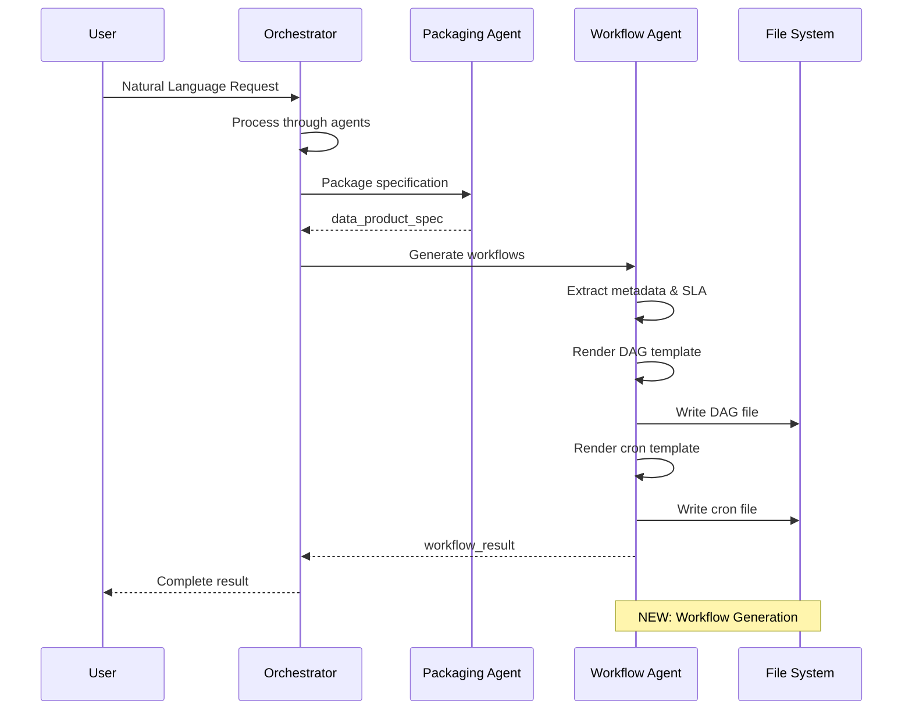
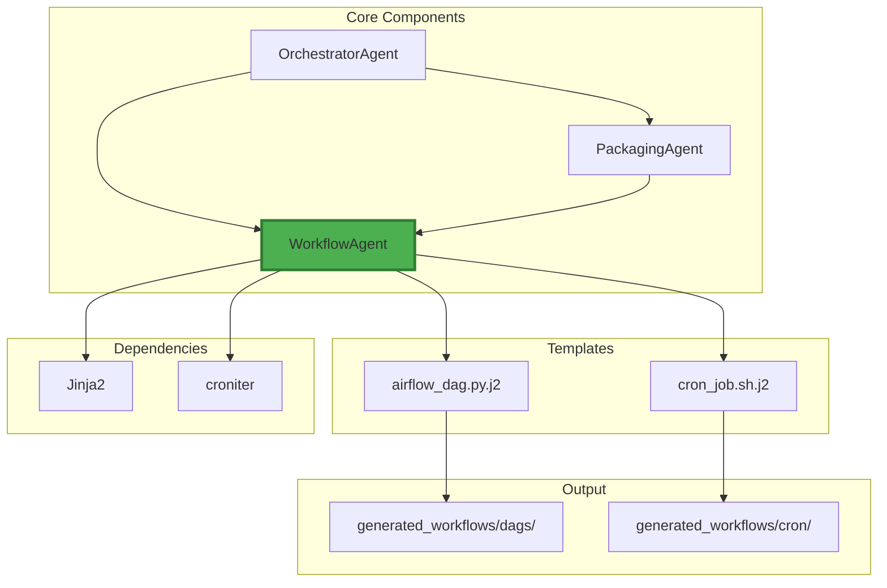

# WorkflowAgent Integration - Visual Flow

## Complete Pipeline Flow



## State Flow



## Workflow Agent Process



## Generated DAG Structure



## Integration Points



## Data Flow



## Component Architecture



## Schedule Extraction Logic

```mermaid
flowchart TD
    A[SLA Freshness] --> B{Contains 'hourly'?}
    B -->|Yes| C[@hourly]
    B -->|No| D{Contains 'daily'?}
    D -->|Yes| E{Time specified?}
    E -->|Yes| F[Extract HH:MM]
    E -->|No| G[Default 6 AM]
    F --> H[MM HH * * *]
    G --> H
    D -->|No| I{Contains 'weekly'?}
    I -->|Yes| J{Day specified?}
    J -->|Yes| K[0 6 * * DAY]
    J -->|No| L[0 6 * * 1]
    I -->|No| M{Contains 'monthly'?}
    M -->|Yes| N[0 6 1 * *]
    M -->|No| O[Default: 0 6 * * *]
    
    style H fill:#4CAF50,stroke:#2E7D32,stroke-width:2px
    style K fill:#4CAF50,stroke:#2E7D32,stroke-width:2px
    style L fill:#4CAF50,stroke:#2E7D32,stroke-width:2px
    style N fill:#4CAF50,stroke:#2E7D32,stroke-width:2px
    style O fill:#4CAF50,stroke:#2E7D32,stroke-width:2px
```
